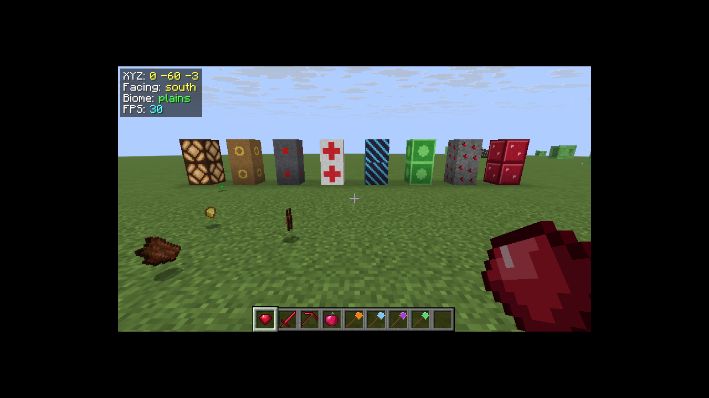

# PyFabric — write Minecraft Fabric mods in Python

PyFabric is a Fabric mod that embeds a real Python 3.12 interpreter ([GraalPy](https://www.graalvm.org/python/))
inside Minecraft. Python mods are plain `.py` files in a `pymods/` folder — no Java, no Gradle, no compiling —
and they can **hot-reload while the game is running**.

```python
# .minecraft/pymods/hello_world/main.py
from pyfabric import command, events, players

@events.on_player_join
def greet(player):
    players.tell(player, f"&6Welcome, {players.name(player)}!")

@command("hello [name:word]")
def hello(ctx, name=None):
    ctx.reply(f"Hello, {name or ctx.name}!")
```



*Blocks, items, textures, the coordinates HUD and the creative tabs above all come from the Python example mods.*

## What you can do from Python

| | |
|---|---|
| **Items** | new items, food with potion effects, swords / pickaxes / axes, durability, rarity, tooltips, right-click powers |
| **Blocks** | new blocks with hardness, sounds, light, tool requirements, drops, and behaviour (step on, right-click, random ticks, redstone power, scheduled ticks…) |
| **World generation** | ores that generate in new chunks |
| **Recipes & data** | shaped / shapeless / smelting / blasting / stonecutting recipes, loot tables, tags, any data-pack JSON |
| **Assets** | drop in PNG textures; models, item definitions and translations are generated for you |
| **Events** | friendly decorators for joins, block breaks, damage, deaths, kills, chat, ticks… and `listen()` for **any** Fabric API event |
| **Commands** | `@command("give_ruby <player:player> [count:int(1,64)=1]")` — typed arguments, optional args, permissions, aliases |
| **Scheduling** | run code later or every N ticks |
| **Storage** | JSON config files and per-world save data |
| **Client** | key bindings, HUD overlays, client ticks (`client.py`) |
| **Java** | every Minecraft, Fabric API and Java class is directly usable: `java.type("net.minecraft.world.item.Items")` |
| **Hot reload** | `/pyfabric reload` swaps in your edited code: events, item/block behaviour, commands, recipes, loot, tags |

## Requirements

* Minecraft **26.3** (Java Edition) with **Fabric Loader ≥ 0.19.5** and **Fabric API**
* Java **25** (what Minecraft 26.x itself needs)
* Python does **not** need to be installed — it ships inside the mod

## Install (players / server owners)

1. Install Fabric for Minecraft 26.3 and put **Fabric API** in `mods/`.
2. Put **`pyfabric-1.0.0.jar`** in `mods/`.
3. Start the game once — a `pymods/` folder appears next to `mods/`.
4. Copy Python mods (e.g. the folders in [`examples/pymods`](examples/pymods)) into `pymods/` and restart.

Mods that add items or blocks must be installed on **both** the server and every client (like Java mods).
Mods that only use events and commands can be installed on the server alone, and client-only mods
(a `client.py` without `main.py`, like `coords_hud`) work on any server.

## Your first mod in 2 minutes

Create `pymods/my_first_mod/main.py`:

```python
from pyfabric import registry, recipes, events, players, mc

ruby = registry.item("ruby", rarity="rare", tooltip="Very shiny")
recipes.shapeless("ruby", ["minecraft:redstone", "minecraft:diamond"])

@ruby.on_use
def use(level, player, hand):
    players.heal(player)
    return mc.SUCCESS

@events.on_block_break
def broke(level, player, pos, state, block_entity):
    players.actionbar(player, f"You broke {mc.id_of(state)}")
```

Add a 16×16 texture at `pymods/my_first_mod/assets/my_first_mod/textures/item/ruby.png`, start the game,
and look in the Ingredients creative tab. Edit the code, run **`/pyfabric reload`**, and the change is live.

➡ Full tutorial: **[docs/getting-started.md](docs/getting-started.md)**

## Documentation

* [Getting started](docs/getting-started.md) — a step-by-step tutorial
* [API reference](docs/api-reference.md) — every module and function
* [Example mods](docs/examples.md) — a guided tour of the 14 examples
* [Using Java & Minecraft classes](docs/java-interop.md) — calling anything in the game, and the gotchas
* [How it works](docs/how-it-works.md) — the architecture, for the curious and for contributors

## Example mods

All in [`examples/pymods`](examples/pymods), each fully commented:

| Mod | Shows |
|---|---|
| `hello_world` | the smallest useful mod: a join greeting and a command |
| `ruby_gear` | a full content mod: gem, block, ore with world generation, tools, food, recipes, creative tab, tags |
| `magic_wands` | items with right-click powers: fireballs, lightning, teleporting, area healing, cooldowns, durability |
| `fun_blocks` | blocks with behaviour: bounce pad, speed path, healing pad, landmine, doorbell, redstone source |
| `server_utils` | `/heal /feed /fly /day /night /spawnmob /near` and homes saved per world |
| `timber` | fell whole trees and mine whole ore veins; a config file |
| `death_tracker` | persistent per-world statistics and a leaderboard |
| `combat_tweaks` | cancelling damage, lifesteal, bonus loot, kill streaks with titles |
| `chat_tools` | chat filter, @mentions with a ping, FAQ auto-responder, `/shout` |
| `announcer` | repeating announcements and an on-screen `/countdown` |
| `treasure_hunt` | a mini-game: hidden loot chest with hot/cold hints |
| `coords_hud` | client-only: HUD overlay with a toggle key |
| `java_interop` | any Fabric event, raw Brigadier commands, Java collections, Java exceptions |
| `one_player_sleep.py` | a complete mod in a single file |

## In-game commands

| Command | |
|---|---|
| `/pyfabric list` | loaded Python mods and their status (failed ones show the error) |
| `/pyfabric reload` | hot-reload all Python mods |
| `/pyfabric run <python>` | run Python in-game, e.g. `/pyfabric run player.getHealth()` (server owners only) |

## Building from source

```bash
./gradlew build          # -> build/libs/pyfabric-1.0.0.jar (GraalPy is bundled inside)
./gradlew runServer      # dev server; Python mods go in run/pymods
./gradlew runClient      # dev client
```

Needs JDK 25. The first build downloads Minecraft, Fabric and GraalPy (~200 MB).

Integration tests drive the example mods with fake players on a dev server — see [`tests/tests.py`](tests/tests.py).

## Good to know

* **Startup** takes about 5–7 extra seconds while the Python runtime starts. The jar is ~55 MB because it contains
  a complete Python (standard library included).
* **Speed:** on a normal JDK, GraalPy runs as an interpreter — fine for events, commands and game logic,
  but avoid scanning millions of blocks per tick. Running Minecraft on a GraalVM JDK should enable its JIT compiler.
* **Hot reload** reruns your code. New items/blocks/key bindings still need a restart (Minecraft locks its registries
  after startup); everything else reloads.
* The whole Python standard library is available. Pure-Python packages from PyPI can be copied into
  `pymods/_lib/` (it is on `sys.path`); packages with native code (numpy etc.) are not supported.

## License

GPL-3.0 (see [LICENSE](LICENSE)). GraalPy is © Oracle and contributors (UPL / PSF licences), bundled unmodified.
The example textures were drawn for this project and are free to reuse.
