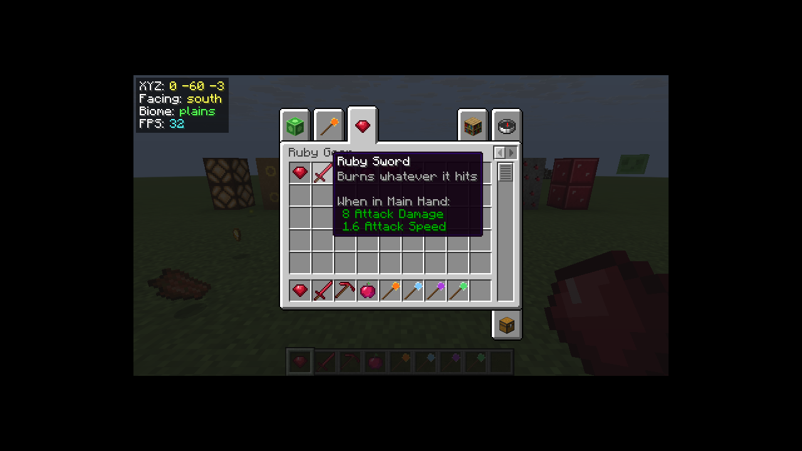

# The example mods

Fourteen example mods live in [`examples/pymods`](../examples/pymods). Copy any of them into your
`.minecraft/pymods/` (or a server's `pymods/`) folder. Each file starts with a docstring describing what
it shows, and the code is commented. They were all tested on Minecraft 26.3 with fake players driving
them (joining, chatting, using items, breaking blocks, dying…).

| Mod | Size | Install on | Highlights |
|---|---|---|---|
| [hello_world](#hello_world) | 22 lines | server | events, commands |
| [ruby_gear](#ruby_gear) | 70 lines | client + server | items, blocks, ore + worldgen, tools, food, recipes, tab, tags |
| [magic_wands](#magic_wands) | 100 lines | client + server | item hooks, cooldowns, durability, raycasts, projectiles |
| [fun_blocks](#fun_blocks) | 95 lines | client + server | block hooks, scheduled ticks, redstone, physics |
| [server_utils](#server_utils) | 110 lines | server | command arguments, permissions, aliases, world storage |
| [timber](#timber) | 60 lines | server | block break event, tags, flood fill, config file |
| [death_tracker](#death_tracker) | 50 lines | server | death/respawn events, persistent stats |
| [combat_tweaks](#combat_tweaks) | 55 lines | server | cancelling damage, kill events, titles |
| [chat_tools](#chat_tools) | 55 lines | server | chat filter, mentions, delayed replies |
| [announcer](#announcer) | 60 lines | server | repeating tasks, countdown with titles |
| [treasure_hunt](#treasure_hunt) | 110 lines | server | a mini-game with state, chests, hints |
| [coords_hud](#coords_hud) | 35 lines | client | key bindings, HUD drawing |
| [java_interop](#java_interop) | 70 lines | server | any Fabric event, raw Brigadier, Java collections |
| [one_player_sleep.py](#one_player_sleep) | 25 lines | server | a mod in a single file |

"Install on: server" mods only use server-side logic, so players don't need them (or PyFabric) on their
client — as long as no mod on the server adds items or blocks, which every client must then have.
(In singleplayer everything runs in your game, so just put them in `.minecraft/pymods`.)

---

## hello_world

The smallest useful mod: greets players on join and adds `/hello [name]`. Read this first.

## ruby_gear

A complete "new material" mod — the template for any content mod:

* `registry.item` for a gem, a sword and a pickaxe (`tool="sword"`, `material="diamond"`), and an apple
  with regeneration + fire resistance (`registry.food`, `registry.effect`)
* `registry.block` for a storage block (iron tool required) and an ore that drops 1–2 rubies (Silk Touch and
  Fortune behave like vanilla ores)
* `worldgen.ore` so ruby ore generates between y=-48 and 24
* recipes: 9 rubies ↔ block, smelting + blasting the ore, the tools, the apple
* a custom creative tab, tags (piglins love rubies; ruby blocks work as a beacon base)
* hooks: the sword sets targets on fire, the apple shimmers, ruby blocks chime when right-clicked
* textures in `assets/ruby_gear/textures/` — everything else (models, names, loot tables) is generated

## magic_wands

Four wands with right-click powers, sharing one `cast()` helper for cooldown and durability:

* **Fire wand** — spawns a `SmallFireball` projectile in the look direction (a plain Java class used from Python)
* **Lightning staff** — raycast with `players.looking_at`, then `world.lightning`
* **Blink wand** — walks along the view ray to find a free spot, teleports there, portal particles
* **Healing staff** — heals and buffs all players within 6 blocks

## fun_blocks

Blocks reacting to players:

* **Bounce pad** — `on_fall` launches entities up and cancels fall damage; `on_step` hops (sneak to stand still)
* **Speed path** — just a property: `speed=1.6`
* **Healing pad** — `on_step` heals players once a second, glows (`light=7`)
* **Landmine** — `on_step` schedules a block tick; `on_scheduled_tick` explodes half a second later
* **Doorbell** — `on_use` rings a bell and notifies nearby players; `on_punch` knocks
* **Pulse block** — `redstone_power` makes it a redstone source; `on_random_tick` sparkles. It reuses a vanilla
  texture (`texture="minecraft:block/redstone_lamp_on"`)

## server_utils

Admin and quality-of-life commands: `/heal [player]`, `/feed`, `/fly`, `/day`, `/night`,
`/spawnmob <type> [count]` (alias `/sm`), `/near [radius]`, and homes: `/sethome [name]`, `/home [name]`,
`/delhome <name>`, `/homes` — saved per world with `storage.world_data()`, up to 3 per player, across
dimensions.

## timber

Two classic mods in one: breaking a log with an axe fells the connected tree; sneak-mining an ore with a
pickaxe mines the connected vein (any ore in the `c:ores` tag, so modded ores too). Damages the tool per
block. Limits and options in `config/pymods/timber.json`.

## death_tracker

Counts deaths per player in the world save, tells players where they died when they respawn, and adds
`/deaths [player]` and a `/deathtop` leaderboard.

## combat_tweaks

* a feather in the off hand cancels fall damage (`on_damage` returning `False`)
* golden swords heal the attacker by a third of the damage dealt (`after_damage`)
* hostile mobs sometimes drop emeralds, gold nuggets or XP bottles (`on_kill`)
* kill streaks: titles at 5, 10, 25… kills, broadcast when a streak ends

## chat_tools

* a word filter that blocks messages (`allow_chat` returning `False`) — words in `config/pymods/chat_tools.json`
* `@name` mentions play a ping sound for that player and show an actionbar notice
* an FAQ auto-responder (answers one tick later so it appears below the question)
* `/shout <message>` shows a title on everyone's screen

## announcer

Rotating tips every few minutes from a config file (`@scheduler.every`), and `/countdown <seconds> [label]`
showing 3… 2… 1… Go! titles to everyone, cancellable with `/countdown_stop`.

## treasure_hunt

A small mini-game: `/hunt start [radius]` hides a chest full of loot at the surface near the players. Every
second, each player sees "Freezing / Cold / Warm / Hot / BURNING HOT" above the hotbar. The first to open the
chest wins. Shows game state in a Python class, filling a chest block entity, the use-block event, and optional
content from another Python mod (rubies are added to the loot if Ruby Gear is installed — note
`"load_after": ["ruby_gear"]` in its `pymod.json`).

## coords_hud

A client-only mod (`client.py`, no `main.py`): a semi-transparent box with coordinates, facing, biome and FPS.
`H` toggles it (rebindable in Controls).

## java_interop

The escape hatches: `events.listen()` with events PyFabric has no shortcut for (`EntitySleepEvents`,
`ServerEntityEvents.ENTITY_LOAD` — every pig gets a name), a Brigadier command built by hand (`/square <n>`),
Java collections, streams and `Optional`, catching a Java exception, enums.

## one_player_sleep

A whole mod in `pymods/one_player_sleep.py`: when one player sleeps for 3 seconds at night, it becomes
morning for everyone.

---

## Ideas for your own mods

* **Quarry block** — `on_random_tick` or a scheduler task that mines blocks below it into a chest above.
* **Backpacks** — an item whose `on_use` opens a chest menu backed by `storage.world_data()`.
* **Custom enchant-like effects** — check `players.held(player)` in `on_attack_entity`.
* **Parkour timer** — pressure-plate blocks with `on_step`, times kept in `world_data`, a `/pk top` command.
* **Economy** — a `/balance` and `/pay` command pair with balances in world data, and a shop sign
  (`on_use_block`).
